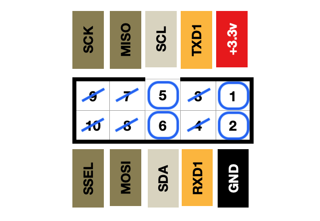
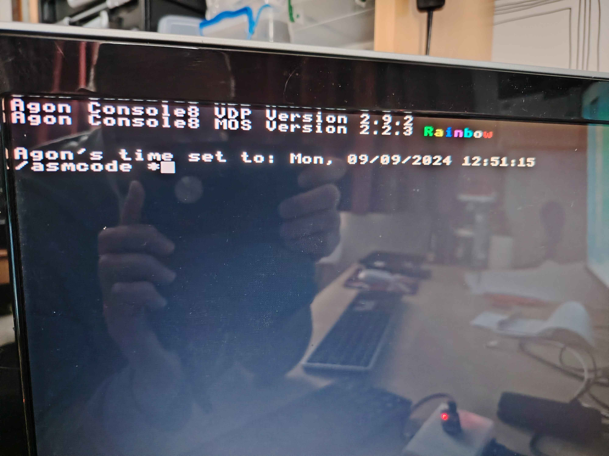

# i2c Modules
This folder contains binaries and code for all lessons on i2c. Whilst these lessons are aimed at z80 assembly language on the Agon light, the theory will be applicable to any microprocessor or computer, such as Raspberry Pi or Pico, Arduino models, and so on.

See accompanying videos at:

https://www.youtube.com/watch?v=WQATfp2rR_Y&list=PL-WZxPxo1iaBRPJj_mS7feUh_gO6pn-Qe&index=3

i2c requires 4 wires to work. 3.3v and GND are obvious, but in addition there is SDA and SCL to connect - a data line and a clock signal.

Either the UEXT connector on the Olimex Agon Light 2 can be used, or the correct pins on any other Agon machine's GPIO bus.

You can connect many different i2c devices at the same time, by linking from one to the next, as long as each device has a diffrent bus address. Some devices have fixed addresses, some can be set, or modified within a range (usually by jumpers or solder pads).

See the community docs for further pinout reference:
https://agonconsole8.github.io/agon-docs/GPIO/

# The Video Lessons

## 01 i2c PCF8574 io port

PCF8574 module is an 8bit digital i/o expander.

Default bus address: $20-28.

The sample code configures the module, then sends a series of bytes to change the output of 8 LEDs.

## 02 i2c pcf8575 16bit io port

PCF8575 module is a 16bit digital i/o expander.
Default bus address: $20-28

Demonstrates reading button inputs and LED outputs.

## 03 i2c 8x8 LED matrix HT16K33

HT16K33 is an 8x8 LED matrix.

Code allows the creation of a buffer to send data to the display. 

Two demo routines, one to send graphical characters to the display, and one to plot/clear random pixels.

Default bus address: $70-$77

## 04 i2c ADS1115 Analog input

This is a 4 channel analog to digital converter.

Default bus address: $48-4B

## 05 i2c MCP4725 analog output

This is a 12bit digital to analog output converter.

Default bus address: $62-61 ?

## 06 DS3231 real Time Clock

This code has been written for RTC modules based on the DS3231 chip, including the MOD_RTC from Olimex.  With an onboard battery, this will keep the correct time, even when your Agon is powered down. 

NOTE: The module does not know when the hour will change due to daylight saving time.

Default bus address: $68

### clock.bin

The program code is reviewed in the video to explain how to read the time and date from the module.

### settime.bin

Place this binary in your SD card's MOS folder. This command will allow you to set the time stored on the DS3231 module. 

Use the command:

<B><i>*setttime</B> seconds minutes hours day date month year</i>

eg: 
<B><i>*settime</B> 0 21 17 1 31 12 24</i>

For 5:21pm and 0 seconds, Sunday, 31st December 2024

(You don't need to type the '*', that is just to indicate the command prompt)

### mos_setrtc.bin

This command is to set the Agon's internal clock to the time stored on your RTC module. So, after the Agon has booted, for example, you can automatically set the internal clock to be the correct time.

Place this binary in your SD card's MOS folder.
Add the command 'mos_setrtc' to your autoexec.txt file if you want it to run after each boot.
Or, call it whenever you want with:

<B><i>*mos_setrtc</i></B>

You can check from MOS that the correct time has been set, by using the built-in command:

<B><i>*time</i></B>

# Other useful tools

### i2ctest.bin
Place this binary in your MOS directory and you can call it at any time by typing:
<B><i>i2ctest</i>.</B>
It will list the addresses of all modules attached to the i2c bus.

### Nintendo WII Nunchuck controller
This is controller has multiple sensors and buttons for user input.
Default bus address: $52

- TO DO-

